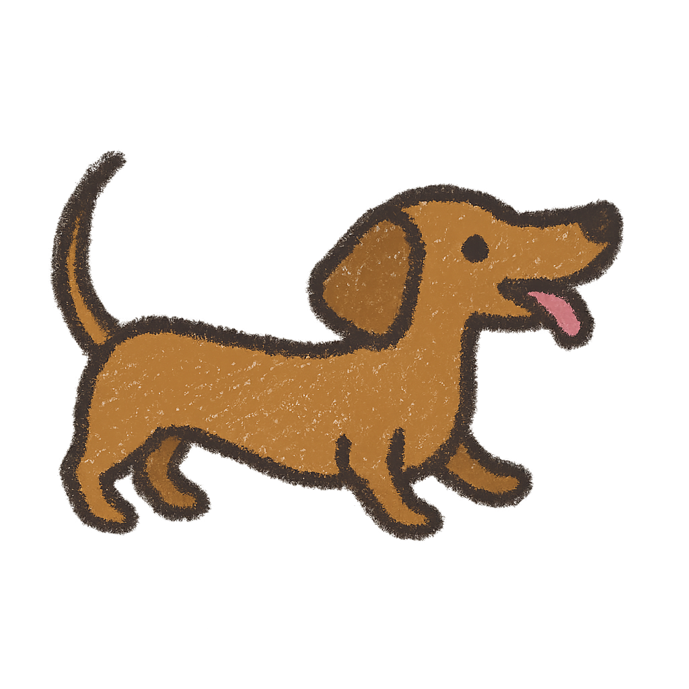

<h1>Opa! Monalisa aqui!</h1>

meocosta, monalisa... no fim é a Maria Elisa

<h3>Fique a vontade!</h3>

  
  
  
  
  
  
  

<h3>Front-end!</h3>

Sou principalmente focada no front-end, back só quando necessário

## 🧠 Aprendendo atualmente

- 🔵 Docker
- 🧩 SvelteKit + SSR
- 📦 Bibliotecas e frameworks
- 🖥️ Design de interfaces responsivas
  

<h3>A Aurora invadiu meu GitHub!</h3>

Esta é minha salsichinha Aurora, minha fiel companheira (e grudinho). Diga oi!

<h3>📚 Cursos e Certificados</h3>

- 🧠 Web para Meninas - USP (2024)
- 🧠 HTML, CSS e JS - Bradesco (2024)

